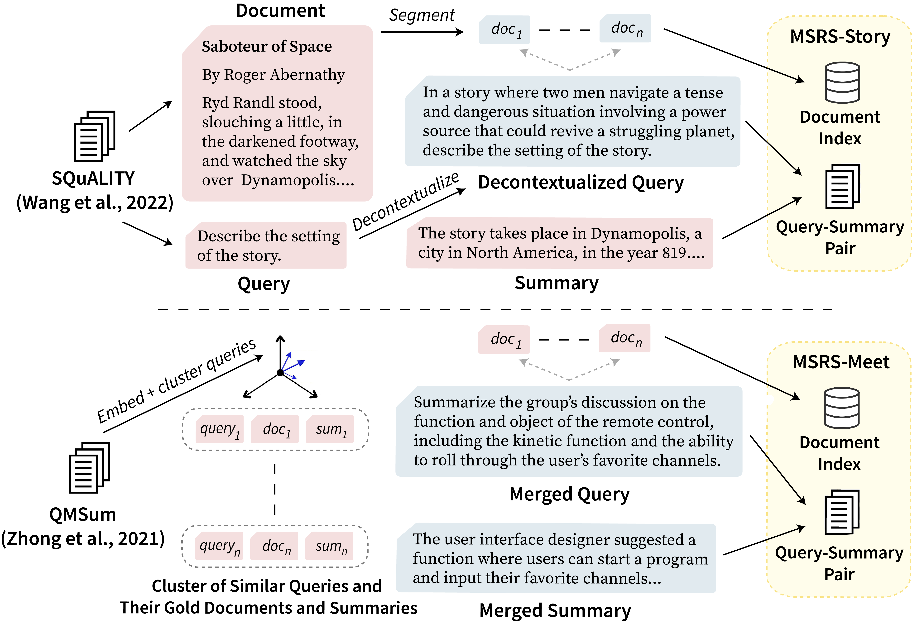
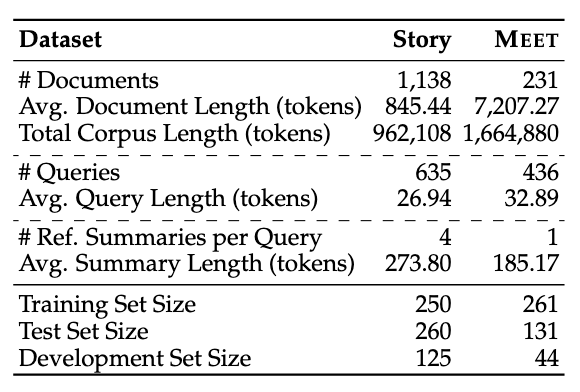
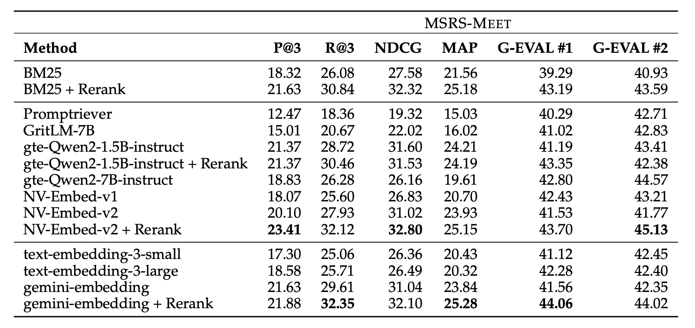
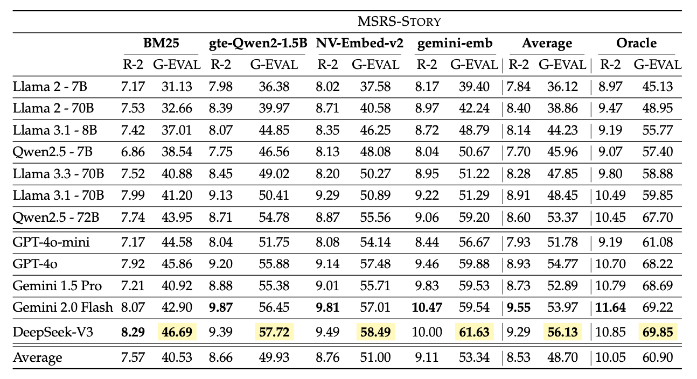
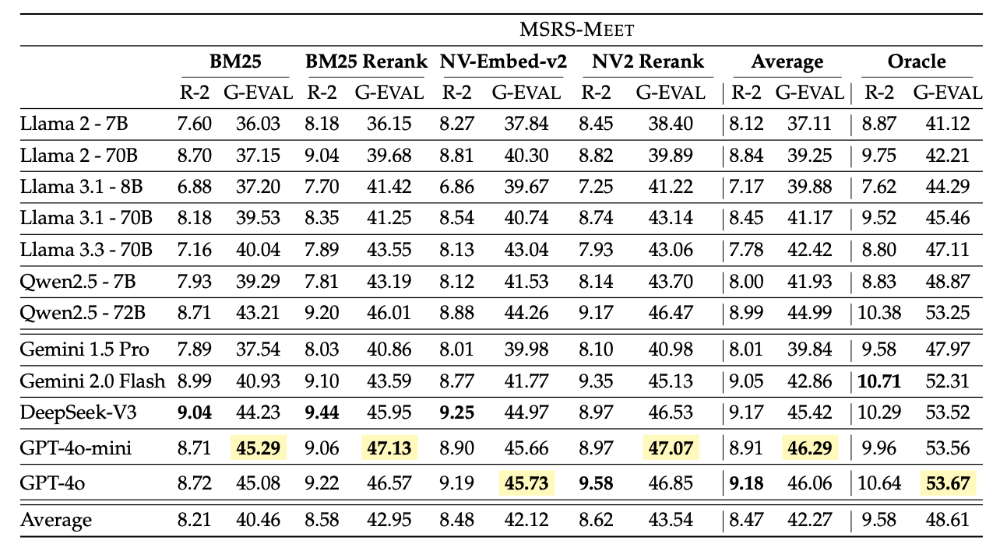

# MSRS: Benchmarking Multi-Source Retrieval-Augmented Generation

<p align="center">
  <a href="https://arxiv.org">📖 Paper</a>
</p>

## Overview

This paper introduces a scalable framework for constructing evaluation benchmarks that challenge RAG systems to integrate information across distinct sources and generate long-form responses. Using our framework, we build two new benchmarks on Multi-Source Retrieval and Synthesis: MSRS-Story and MSRS-Meet.

<p align="center">
  
</p>

### Dataset Statistics

<p align="center">
  
</p>

### Repository Structure

The datasets for MSRS-Story and MSRS-Meet are provided in the `data` directory. 

The retrieval code and its associated settings, which serve as inputs for summarization, are located in the `code/retrieval` directory.

The summarization code is included in `code/summarization`.

The evaluation code, along with the generated summaries and their corresponding evaluation results (e.g., ROUGE-2, G-Eval), are located in the `code/evaluation` directory.

## Quickstart

### 1. Setup

Install the required packages using Python version >=3.9. 

```
pip install -r requirements.txt
```

### 2. Run

Examples for running the retrieval, summarization, and evaluation scripts are provided in `usage.sh` files alongside the scripts.


## Experimental Results

Retrieval Peformance for MSRS-Story

<p align="center">
  
</p>

Retrieval Peformance for MSRS-Meet

<p align="center">
  
</p>

Summarization Performance for MSRS-Story

<p align="center">
  
</p>


Summarization Performance for MSRS-Meet

<p align="center">
  
</p>

Oracle Summarization Performance for Reasoning Models

<p align="center">
  
</p>

